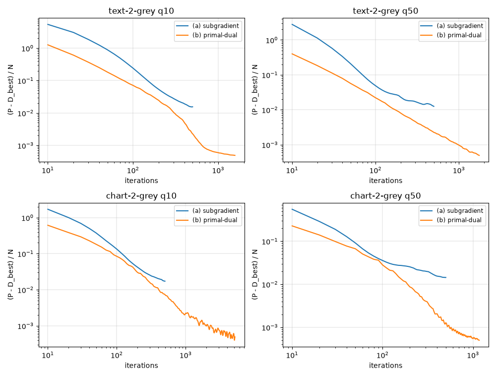
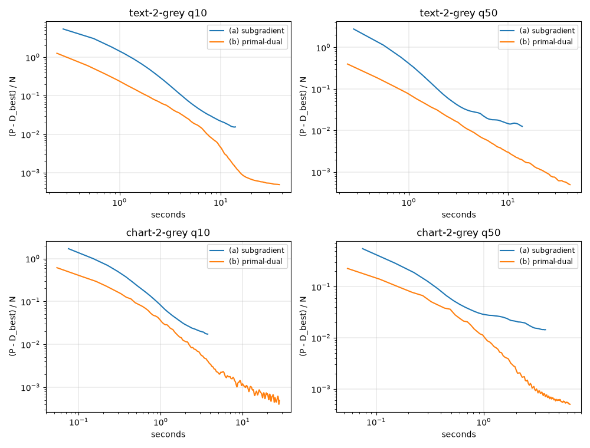

<!-- Written by experiments/phase1_comparison.py; do not edit by hand. -->

# Phase 1: the methods compared on the test images

- Files: the greyscale test images (`data/synthetic/test`), 144 files of libjpeg-turbo, mozjpeg at qualities 10, 20, 30, 50, 70, 90.
- Methods: the standard decoder (libjpeg's accurate integer inverse DCT, 8 bits); (d) the MMSE decoder; (a) the subgradient method of jpeg2png's kind after 50 and 500 iterations; (b) TV and (c) TGV by the primal-dual method with the defaults of `unround.decode.Settings`: for TV $\tau/\sigma = 30$, stopping at a gap per sample of 0.0005 or after 20000 iterations; for TGV $\tau/\sigma = 3$, 0.01, 20000.
- Model: $\mu = 10^{-3}$; TV $\alpha = 1$; TGV $\alpha_1 = 1$, $\alpha_0 = 2$.
- Measures, against the original: the PSNR of the binary64 result and of its 8-bit samples (rounded half away from zero, clamped to 0-255), and the SSIM (Gaussian weights of 1.5) and PSNR-B of the 8-bit samples. The means are over the images.
- NumPy 2.5.3, SciPy 1.18.1, scikit-image 0.26.0.

## Quality: `libjpeg-turbo`

**PSNR of the 8-bit samples, dB**

| quality | standard | (d) MMSE | (a) 50 | (a) 500 | (b) TV | (c) TGV |
|---|---|---|---|---|---|---|
| 10 | 25.744 | 25.564 | 26.040 | 26.170 | 26.129 | 26.158 |
| 20 | 28.396 | 28.314 | 29.196 | 29.341 | 29.283 | 29.393 |
| 30 | 30.335 | 30.277 | 31.626 | 31.751 | 31.688 | 31.760 |
| 50 | 33.060 | 32.940 | 34.705 | 34.653 | 34.621 | 34.666 |
| 70 | 36.194 | 35.960 | 38.087 | 37.784 | 37.737 | 37.785 |
| 90 | 44.129 | 43.807 | 45.940 | 45.554 | 45.560 | 45.564 |

**SSIM of the 8-bit samples**

| quality | standard | (d) MMSE | (a) 50 | (a) 500 | (b) TV | (c) TGV |
|---|---|---|---|---|---|---|
| 10 | 0.89888 | 0.90917 | 0.94757 | 0.95455 | 0.95473 | 0.95207 |
| 20 | 0.93252 | 0.94373 | 0.97416 | 0.97736 | 0.97739 | 0.97661 |
| 30 | 0.94728 | 0.95727 | 0.98521 | 0.98702 | 0.98711 | 0.98682 |
| 50 | 0.96398 | 0.97159 | 0.99296 | 0.99353 | 0.99358 | 0.99338 |
| 70 | 0.97720 | 0.98203 | 0.99669 | 0.99676 | 0.99672 | 0.99670 |
| 90 | 0.99409 | 0.99500 | 0.99943 | 0.99943 | 0.99946 | 0.99942 |

**PSNR-B of the 8-bit samples, dB**

| quality | standard | (d) MMSE | (a) 50 | (a) 500 | (b) TV | (c) TGV |
|---|---|---|---|---|---|---|
| 10 | 23.049 | 22.503 | 24.205 | 25.322 | 25.268 | 25.336 |
| 20 | 25.976 | 24.990 | 26.833 | 27.865 | 27.794 | 27.911 |
| 30 | 27.956 | 26.585 | 28.686 | 29.699 | 29.624 | 29.692 |
| 50 | 30.620 | 28.883 | 30.802 | 31.599 | 31.543 | 31.597 |
| 70 | 33.722 | 31.302 | 33.127 | 33.670 | 33.613 | 33.656 |
| 90 | 39.453 | 37.578 | 38.846 | 38.810 | 38.798 | 38.808 |

**PSNR of the binary64 result, dB**

| quality | standard | (d) MMSE | (a) 50 | (a) 500 | (b) TV | (c) TGV |
|---|---|---|---|---|---|---|
| 10 | 25.744 | 25.205 | 25.951 | 26.129 | 26.088 | 26.066 |
| 20 | 28.396 | 27.907 | 29.155 | 29.297 | 29.231 | 29.351 |
| 30 | 30.335 | 29.770 | 31.547 | 31.704 | 31.643 | 31.693 |
| 50 | 33.060 | 32.351 | 34.621 | 34.622 | 34.590 | 34.597 |
| 70 | 36.194 | 35.332 | 38.013 | 37.729 | 37.696 | 37.712 |
| 90 | 44.129 | 43.059 | 45.861 | 45.484 | 45.501 | 45.473 |

## Quality: `mozjpeg`

**PSNR of the 8-bit samples, dB**

| quality | standard | (d) MMSE | (a) 50 | (a) 500 | (b) TV | (c) TGV |
|---|---|---|---|---|---|---|
| 10 | 22.783 | 22.480 | 22.651 | 22.756 | 22.712 |  |
| 20 | 25.454 | 25.135 | 25.611 | 25.742 | 25.715 |  |
| 30 | 27.124 | 26.777 | 27.466 | 27.554 | 27.525 |  |
| 50 | 29.253 | 28.875 | 29.826 | 29.921 | 29.902 |  |
| 70 | 31.586 | 31.149 | 32.436 | 32.568 | 32.551 |  |
| 90 | 37.468 | 36.909 | 39.214 | 39.214 | 39.216 |  |

**SSIM of the 8-bit samples**

| quality | standard | (d) MMSE | (a) 50 | (a) 500 | (b) TV | (c) TGV |
|---|---|---|---|---|---|---|
| 10 | 0.87315 | 0.87234 | 0.89518 | 0.90265 | 0.90257 |  |
| 20 | 0.92071 | 0.92219 | 0.94402 | 0.94833 | 0.94823 |  |
| 30 | 0.94119 | 0.94292 | 0.96335 | 0.96630 | 0.96631 |  |
| 50 | 0.96064 | 0.96199 | 0.98000 | 0.98151 | 0.98157 |  |
| 70 | 0.97411 | 0.97550 | 0.98938 | 0.99009 | 0.99007 |  |
| 90 | 0.99136 | 0.99201 | 0.99787 | 0.99789 | 0.99792 |  |

**PSNR-B of the 8-bit samples, dB**

| quality | standard | (d) MMSE | (a) 50 | (a) 500 | (b) TV | (c) TGV |
|---|---|---|---|---|---|---|
| 10 | 20.273 | 20.056 | 21.148 | 21.980 | 21.941 |  |
| 20 | 22.356 | 22.064 | 23.505 | 24.376 | 24.344 |  |
| 30 | 23.777 | 23.380 | 24.922 | 25.678 | 25.646 |  |
| 50 | 25.855 | 25.327 | 26.866 | 27.474 | 27.449 |  |
| 70 | 28.005 | 27.321 | 28.892 | 29.397 | 29.378 |  |
| 90 | 32.879 | 32.043 | 33.566 | 33.761 | 33.762 |  |

**PSNR of the binary64 result, dB**

| quality | standard | (d) MMSE | (a) 50 | (a) 500 | (b) TV | (c) TGV |
|---|---|---|---|---|---|---|
| 10 | 22.783 | 21.646 | 22.115 | 22.165 | 22.100 |  |
| 20 | 25.454 | 23.747 | 24.624 | 24.800 | 24.767 |  |
| 30 | 27.124 | 24.865 | 25.933 | 26.080 | 26.046 |  |
| 50 | 29.253 | 26.309 | 27.589 | 27.777 | 27.754 |  |
| 70 | 31.586 | 28.723 | 30.311 | 30.497 | 30.479 |  |
| 90 | 37.468 | 35.086 | 37.655 | 37.681 | 37.679 |  |

## Consistency with the file

For each result, over every file: the least share of the coefficients within their intervals, in percent, and the largest excess beyond them, in steps. The canvas is the solver's own (for the standard decoder, its planes of whole blocks); the picture is the result cut to the size of the image and padded again as libjpeg's encoder pads it, in binary64 and in 8 bits: whether a file that encoded it would read as the same file. The blocks wholly within the picture are those whose samples the padding does not touch; at the right and bottom edges of a picture that is not whole blocks, the padding repeats the picture's last samples where the canvas has its own. A coefficient that the solvers leave at an end of its interval is outside by the rounding of the round trip of the DCT half the time, which the shares count.

**`libjpeg-turbo`**

| result | canvas | picture, binary64: whole blocks | every block | picture, 8 bits: whole blocks | every block |
|---|---|---|---|---|---|
| standard | 95.854 / 4.75e+00 | 95.854 / 4.75e+00 | 95.854 / 5.65e+00 | 95.854 / 4.75e+00 | 95.854 / 5.65e+00 |
| (d) MMSE | 100.000 / 0.00e+00 | 100.000 / 0.00e+00 | 99.494 / 5.38e+00 | 95.858 / 4.40e+00 | 95.858 / 5.53e+00 |
| (a) 50 | 93.790 / 3.03e-13 | 93.641 / 3.03e-13 | 93.598 / 2.77e+00 | 89.970 / 2.55e+00 | 90.119 / 2.67e+00 |
| (a) 500 | 93.748 / 3.03e-13 | 93.574 / 3.03e-13 | 93.538 / 3.02e+00 | 90.283 / 2.44e+00 | 90.427 / 3.25e+00 |
| (b) TV | 93.055 / 3.03e-13 | 92.893 / 3.03e-13 | 92.905 / 3.38e+00 | 90.477 / 2.28e+00 | 90.625 / 3.28e+00 |
| (c) TGV | 92.923 / 3.79e-13 | 92.744 / 3.79e-13 | 92.759 / 3.25e+00 | 90.490 / 2.37e+00 | 90.630 / 3.26e+00 |

**`mozjpeg`**

| result | canvas | picture, binary64: whole blocks | every block | picture, 8 bits: whole blocks | every block |
|---|---|---|---|---|---|
| standard | 90.498 / 1.80e+01 | 90.498 / 1.80e+01 | 90.498 / 1.80e+01 | 90.498 / 1.80e+01 | 90.498 / 1.80e+01 |
| (d) MMSE | 100.000 / 0.00e+00 | 100.000 / 0.00e+00 | 99.255 / 1.16e+01 | 89.935 / 1.70e+01 | 89.935 / 1.78e+01 |
| (a) 50 | 91.085 / 3.79e-13 | 90.969 / 3.79e-13 | 90.647 / 7.75e+00 | 87.206 / 1.52e+01 | 87.109 / 1.52e+01 |
| (a) 500 | 90.773 / 3.79e-13 | 90.648 / 3.79e-13 | 90.377 / 8.12e+00 | 86.524 / 1.53e+01 | 86.469 / 1.53e+01 |
| (b) TV | 89.719 / 3.79e-13 | 89.596 / 3.79e-13 | 89.388 / 8.09e+00 | 86.694 / 1.53e+01 | 86.633 / 1.53e+01 |

## Iterations and time: `libjpeg-turbo`

**(b) TV**

| quality | iterations: median (least to largest) | within the tolerance | seconds: median (least to largest) |
|---|---|---|---|
| 10 | 3715 (1480 to 5180) | 12 of 12 | 32.95 (6.48 to 100.70) |
| 20 | 2515 (1500 to 3330) | 12 of 12 | 26.35 (7.58 to 73.20) |
| 30 | 1650 (1410 to 2380) | 12 of 12 | 16.70 (5.59 to 53.75) |
| 50 | 1330 (1170 to 2010) | 12 of 12 | 14.29 (4.44 to 42.18) |
| 70 | 1380 (990 to 2100) | 12 of 12 | 17.08 (3.94 to 45.21) |
| 90 | 1560 (1360 to 2350) | 12 of 12 | 17.91 (5.41 to 45.77) |

**(c) TGV**

| quality | iterations: median (least to largest) | within the tolerance | seconds: median (least to largest) |
|---|---|---|---|
| 10 | 6230 (4170 to 9630) | 12 of 12 | 137.78 (46.51 to 435.38) |
| 20 | 4835 (3730 to 7510) | 12 of 12 | 118.74 (40.58 to 420.81) |
| 30 | 4310 (3250 to 6830) | 12 of 12 | 108.75 (34.35 to 382.71) |
| 50 | 3730 (2740 to 5330) | 12 of 12 | 96.12 (28.96 to 298.66) |
| 70 | 2985 (2330 to 4410) | 12 of 12 | 81.70 (21.76 to 247.11) |
| 90 | 2030 (1290 to 3210) | 12 of 12 | 59.65 (15.01 to 170.50) |

## Iterations and time: `mozjpeg`

**(b) TV**

| quality | iterations: median (least to largest) | within the tolerance | seconds: median (least to largest) |
|---|---|---|---|
| 10 | 2590 (1920 to 4340) | 12 of 12 | 28.29 (9.07 to 84.53) |
| 20 | 1995 (1440 to 2820) | 12 of 12 | 22.75 (6.87 to 59.54) |
| 30 | 1470 (1140 to 2610) | 12 of 12 | 16.52 (5.30 to 62.91) |
| 50 | 1300 (930 to 1470) | 12 of 12 | 14.89 (4.02 to 32.30) |
| 70 | 1085 (980 to 1410) | 12 of 12 | 14.09 (4.16 to 25.32) |
| 90 | 1230 (860 to 1770) | 12 of 12 | 15.28 (3.72 to 32.78) |

The seconds are the iterations times the time an iteration took on the image, measured one run after another in one process (`timing`): per iteration, subgradient 12.2 ms; tv 11.2 ms; tgv 28.3 ms (medians over the images).

## The objective: (b) against (a), `libjpeg-turbo`

**The iterations (b) took to reach (a)'s objective after 50 iterations**: (b) needed fewer on 72 of 72 files.

| quality | iterations: median (least to largest) | not before its stop | fewer than 50 |
|---|---|---|---|
| 10 | 20 (20 to 30) | 0 | 12 of 12 |
| 20 | 20 (20 to 30) | 0 | 12 of 12 |
| 30 | 20 (20 to 40) | 0 | 12 of 12 |
| 50 | 20 (20 to 40) | 0 | 12 of 12 |
| 70 | 30 (20 to 40) | 0 | 12 of 12 |
| 90 | 20 (20 to 40) | 0 | 12 of 12 |

**The iterations (b) took to reach (a)'s objective after 500 iterations**: (b) needed fewer on 72 of 72 files.

| quality | iterations: median (least to largest) | not before its stop | fewer than 500 |
|---|---|---|---|
| 10 | 325 (210 to 490) | 0 | 12 of 12 |
| 20 | 290 (210 to 340) | 0 | 12 of 12 |
| 30 | 200 (180 to 230) | 0 | 12 of 12 |
| 50 | 160 (150 to 200) | 0 | 12 of 12 |
| 70 | 125 (120 to 150) | 0 | 12 of 12 |
| 90 | 90 (60 to 120) | 0 | 12 of 12 |

## The objective: (b) against (a), `mozjpeg`

**The iterations (b) took to reach (a)'s objective after 50 iterations**: (b) needed fewer on 72 of 72 files.

| quality | iterations: median (least to largest) | not before its stop | fewer than 50 |
|---|---|---|---|
| 10 | 20 (20 to 20) | 0 | 12 of 12 |
| 20 | 20 (20 to 40) | 0 | 12 of 12 |
| 30 | 20 (20 to 40) | 0 | 12 of 12 |
| 50 | 20 (20 to 40) | 0 | 12 of 12 |
| 70 | 20 (20 to 40) | 0 | 12 of 12 |
| 90 | 25 (20 to 30) | 0 | 12 of 12 |

**The iterations (b) took to reach (a)'s objective after 500 iterations**: (b) needed fewer on 72 of 72 files.

| quality | iterations: median (least to largest) | not before its stop | fewer than 500 |
|---|---|---|---|
| 10 | 305 (200 to 460) | 0 | 12 of 12 |
| 20 | 230 (200 to 330) | 0 | 12 of 12 |
| 30 | 205 (180 to 230) | 0 | 12 of 12 |
| 50 | 160 (140 to 190) | 0 | 12 of 12 |
| 70 | 135 (110 to 150) | 0 | 12 of 12 |
| 90 | 90 (70 to 120) | 0 | 12 of 12 |

## Figures

