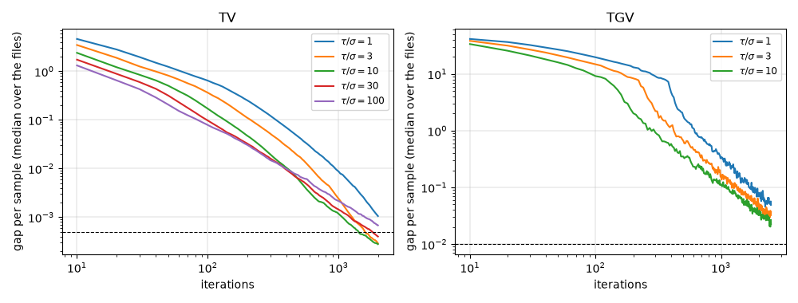
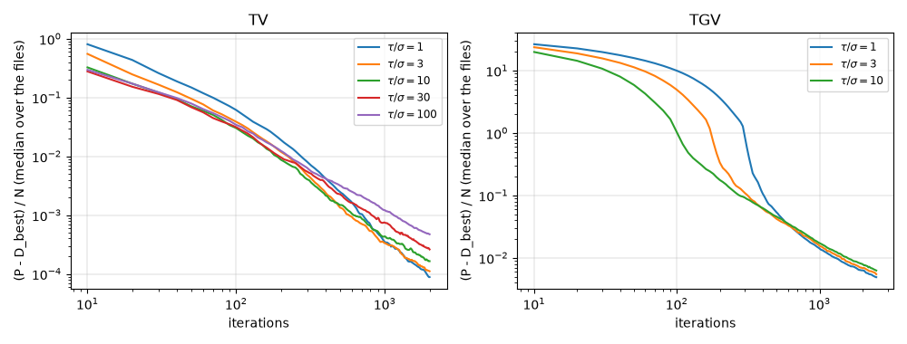
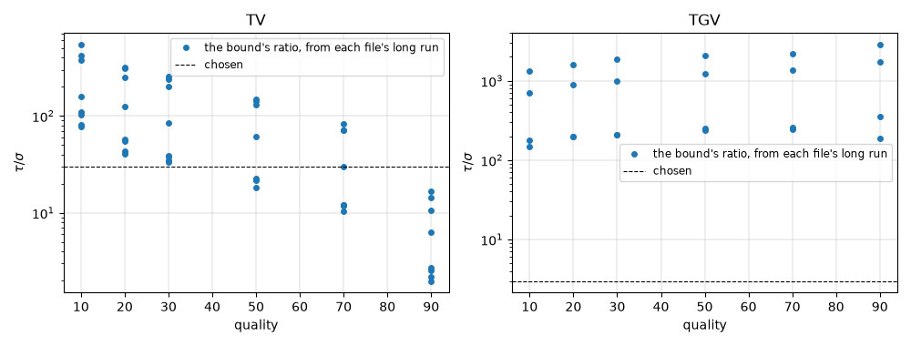

<!-- Written by experiments/phase1_tuning.py; do not edit by hand. -->

# Phase 1 tuning: the ratio of the steps and the stopping tolerance

- Files: the greyscale tuning images (`data/synthetic/tuning`) as libjpeg-turbo encoded them at qualities 10, 20, 30, 50, 70, 90: TV on all 48 files, TGV on the 24 of the first image of each kind.
- Model: the weights of `unround.decode.Settings`: $\mu = 10^{-3}$; TV $\alpha = 1$; TGV $\alpha_1 = 1$, $\alpha_0 = 2$.
- Runs: TV with $\tau/\sigma$ = 1, 3, 10, 30, 100 for 2000 iterations, and 30 for 6000 (the long run); TGV with $\tau/\sigma$ = 1, 3, 10 for 2500 iterations, and 3 for 8000 (the long run). The gap is recorded every 10 iterations; the canvases are measured at iterations about 25 percent apart.
- Stops: TV with $\tau/\sigma$ = 10, 20, 30, until the gap per sample is within 0.0005 or for 6000 iterations; TGV with $\tau/\sigma$ = 3, until the gap per sample is within 0.005 or for 8000 iterations. The result is measured exactly where the gap first falls within each tolerance.
- A tolerance is acceptable when stopping at it changes, on every file, the PSNR of the binary64 result by at most 0.01 dB and the SSIM of its 8-bit samples by at most 0.0001, against the last point of the file's long run. The PSNR of the 8-bit samples is shown, not held to a limit: rounding moves it by about 0.01 dB from one iterate to the next.
- NumPy 2.5.3, SciPy 1.18.1, scikit-image 0.26.0.

## TV

### Stopping at a tolerance

| $\tau/\sigma$ | gap per sample ≤ | files that reached it | iterations: median (least to largest) | iterations in all | largest \|Δ PSNR\|, binary64, dB | largest \|Δ PSNR\|, 8 bits, dB | largest \|Δ SSIM\|, 8 bits | acceptable |
|---|---|---|---|---|---|---|---|---|
| 10 | 0.01 | 48 of 48 | 410 (130 to 1600) | 26700 | 0.0398 | 0.0346 | 2.1e-04 | no |
| 10 | 0.005 | 48 of 48 | 525 (190 to 2190) | 35790 | 0.0242 | 0.0228 | 2.4e-04 | no |
| 10 | 0.002 | 48 of 48 | 755 (320 to 3280) | 52910 | 0.0177 | 0.0246 | 1.8e-04 | no |
| 10 | 0.001 | 48 of 48 | 1065 (480 to 4420) | 70770 | 0.0194 | 0.0251 | 1.5e-04 | no |
| 10 | 0.0005 | 48 of 48 | 1425 (740 to 5340) | 93470 | 0.0185 | 0.0226 | 1.6e-04 | no |
| 20 | 0.01 | 48 of 48 | 400 (140 to 1500) | 24000 | 0.0350 | 0.0236 | 2.1e-04 | no |
| 20 | 0.005 | 48 of 48 | 550 (210 to 2060) | 32830 | 0.0183 | 0.0264 | 1.9e-04 | no |
| 20 | 0.002 | 48 of 48 | 770 (370 to 3290) | 49810 | 0.0208 | 0.0266 | 1.6e-04 | no |
| 20 | 0.001 | 48 of 48 | 1080 (570 to 4300) | 67950 | 0.0135 | 0.0263 | 1.4e-04 | no |
| 20 | 0.0005 | 48 of 48 | 1590 (850 to 5330) | 91520 | 0.0099 | 0.0182 | 1.2e-04 | no |
| 30 | 0.01 | 48 of 48 | 395 (140 to 1430) | 23190 | 0.0367 | 0.0298 | 2.0e-04 | no |
| 30 | 0.005 | 48 of 48 | 555 (220 to 2080) | 31990 | 0.0188 | 0.0332 | 1.3e-04 | no |
| 30 | 0.002 | 48 of 48 | 845 (410 to 3290) | 49250 | 0.0156 | 0.0280 | 1.5e-04 | no |
| 30 | 0.001 | 48 of 48 | 1225 (620 to 4270) | 68590 | 0.0129 | 0.0129 | 9.4e-05 | no |
| 30 | 0.0005 | 48 of 48 | 1815 (930 to 5310) | 94850 | 0.0083 | 0.0197 | 6.4e-05 | yes |

Chosen: $\tau/\sigma = 30$, stopping at a gap per sample of 0.0005, and after at most 20000 iterations (twice the most a tuning file took, rounded up).

The long runs' own change over their last sixth, against which the stops are measured: median (least to largest) over the files.

| iterations | \|Δ PSNR\|, binary64, dB | \|Δ SSIM\|, 8 bits |
|---|---|---|
| 5000 to 6000 | 0.0001 (0.0000 to 0.0068) | 5.5e-07 (3.1e-09 to 2.9e-05) |

### How fast each ratio brings the gap down

The iterations to the first gap per sample within a tolerance: median over the files (how many reached it within 2000).

| gap per sample ≤ | $\tau/\sigma = 1$ | $\tau/\sigma = 3$ | $\tau/\sigma = 10$ | $\tau/\sigma = 30$ | $\tau/\sigma = 100$ |
|---|---|---|---|---|---|
| 0.02 | 700 (43) | 475 (48) | 300 (48) | 270 (48) | 260 (48) |
| 0.01 | 950 (38) | 620 (45) | 410 (48) | 395 (48) | 400 (48) |
| 0.005 | 1235 (34) | 800 (42) | 525 (46) | 555 (47) | 620 (48) |
| 0.002 | 1660 (27) | 1055 (36) | 755 (43) | 845 (45) | 1045 (45) |
| 0.001 | > 2000 (24) | 1275 (30) | 1065 (37) | 1225 (40) | 1595 (37) |

### The primal values

$(P - D)/N$ at some iterations, with D the greatest dual value any run of the file reached: an upper bound of how far the primal value is from the least, tighter than a run's own gap. Median (least to largest) over the files.

| $\tau/\sigma$ | 100 | 300 | 1000 | 2000 |
|---|---|---|---|---|
| 1 | 6.1e-02 (4.6e-03 to 6.9e-01) | 8.1e-03 (5.6e-04 to 1.0e-01) | 3.5e-04 (5.3e-05 to 6.2e-03) | 8.8e-05 (1.7e-05 to 1.6e-03) |
| 3 | 3.9e-02 (5.4e-03 to 3.1e-01) | 4.8e-03 (7.7e-04 to 3.8e-02) | 3.3e-04 (9.3e-05 to 3.5e-03) | 1.1e-04 (3.3e-05 to 9.8e-04) |
| 10 | 3.0e-02 (7.2e-03 to 1.4e-01) | 4.1e-03 (1.2e-03 to 2.3e-02) | 4.3e-04 (1.3e-04 to 3.8e-03) | 1.6e-04 (5.2e-05 to 1.1e-03) |
| 30 | 3.1e-02 (8.9e-03 to 9.3e-02) | 5.5e-03 (2.0e-03 to 2.7e-02) | 7.4e-04 (2.1e-04 to 4.6e-03) | 2.6e-04 (8.2e-05 to 1.7e-03) |
| 100 | 3.4e-02 (1.2e-02 to 1.0e-01) | 6.4e-03 (3.4e-03 to 2.7e-02) | 1.2e-03 (4.2e-04 to 5.5e-03) | 4.7e-04 (1.7e-04 to 1.7e-03) |

### The ratio that the bound of the rate chooses

$(\lVert z^\ast - z^0 \rVert / \lVert y^\ast \rVert)^2$ from the start and the last point of each long run (docs/math.md, 5), with the distances per square root of the number of samples. Median (least to largest) over the images.

| quality | $(\lVert z^\ast - z^0 \rVert / \lVert y^\ast \rVert)^2$ | $\lVert z^\ast - z^0 \rVert / \sqrt{N}$ | $\lVert y^\ast \rVert / \sqrt{N}$ | last gap per sample |
|---|---|---|---|---|
| 10 | 134 (77.1 to 544) | 9.13 (6.92 to 17.1) | 0.767 (0.724 to 0.827) | 1.1e-04 (2.6e-05 to 5.4e-04) |
| 20 | 91 (40.6 to 317) | 7.15 (4.67 to 13.4) | 0.743 (0.714 to 0.832) | 3.3e-05 (1.2e-05 to 2.5e-04) |
| 30 | 61.9 (33.7 to 256) | 6.1 (3.72 to 11.1) | 0.71 (0.629 to 0.865) | 3.7e-05 (2.1e-05 to 1.1e-04) |
| 50 | 42.1 (18.3 to 147) | 4.79 (2.82 to 8.69) | 0.694 (0.608 to 0.887) | 3.5e-05 (2.8e-05 to 6.9e-05) |
| 70 | 21.2 (10.5 to 82) | 3.57 (2.09 to 6.38) | 0.699 (0.6 to 0.917) | 5.7e-05 (3.3e-05 to 1.2e-04) |
| 90 | 4.51 (1.98 to 16.9) | 1.64 (0.908 to 2.81) | 0.683 (0.61 to 0.944) | 8.5e-05 (3.9e-05 to 1.2e-04) |

### How far the iterates still move

The RMS difference, in grey levels, of the canvas of each long run at some iterations from its last. Median (least to largest) over the files.

| iterations | RMS to the last |
|---|---|
| 300 | 2.51e-01 (5.19e-02 to 1.65e+00) |
| 1000 | 8.61e-02 (2.13e-02 to 6.24e-01) |
| 2000 | 3.56e-02 (8.36e-03 to 4.03e-01) |
| 5000 | 3.80e-03 (9.95e-04 to 1.09e-01) |

## TGV

### Stopping at a tolerance

| $\tau/\sigma$ | gap per sample ≤ | files that reached it | iterations: median (least to largest) | iterations in all | largest \|Δ PSNR\|, binary64, dB | largest \|Δ PSNR\|, 8 bits, dB | largest \|Δ SSIM\|, 8 bits | acceptable |
|---|---|---|---|---|---|---|---|---|
| 3 | 0.05 | 24 of 24 | 1760 (550 to 3580) | 46570 | 0.1226 | 0.0563 | 2.4e-04 | no |
| 3 | 0.02 | 24 of 24 | 2905 (990 to 5200) | 71270 | 0.0894 | 0.0327 | 1.1e-04 | no |
| 3 | 0.01 | 24 of 24 | 3925 (1600 to 7300) | 99270 | 0.0837 | 0.0246 | 5.4e-05 | no |
| 3 | 0.005 | 20 of 24 | 5445 (2400 to 7890) | 107110 | 0.0701 | 0.0122 | 4.7e-05 | no |

No ratio has a tolerance that every file reached and that is acceptable. Chosen, the least tolerance that every file reached: $\tau/\sigma = 3$, stopping at a gap per sample of 0.01, and after at most 20000 iterations (twice the most a tuning file took, rounded up). Stopping there changed the PSNR by up to 0.084 dB.

The long runs' own change over their last sixth, against which the stops are measured: median (least to largest) over the files.

| iterations | \|Δ PSNR\|, binary64, dB | \|Δ SSIM\|, 8 bits |
|---|---|---|
| 6666 to 8000 | 0.0018 (0.0001 to 0.0249) | 2.7e-06 (9.5e-08 to 3.9e-05) |

### How fast each ratio brings the gap down

The iterations to the first gap per sample within a tolerance: median over the files (how many reached it within 2500).

| gap per sample ≤ | $\tau/\sigma = 1$ | $\tau/\sigma = 3$ | $\tau/\sigma = 10$ |
|---|---|---|---|
| 0.1 | 1670 (21) | 1220 (23) | 1020 (24) |
| 0.05 | 2115 (13) | 1760 (17) | 1490 (20) |
| 0.02 | > 2500 (8) | > 2500 (8) | > 2500 (12) |
| 0.01 | > 2500 (2) | > 2500 (4) | > 2500 (5) |

### The primal values

$(P - D)/N$ at some iterations, with D the greatest dual value any run of the file reached: an upper bound of how far the primal value is from the least, tighter than a run's own gap. Median (least to largest) over the files.

| $\tau/\sigma$ | 100 | 300 | 1000 | 2000 |
|---|---|---|---|---|
| 1 | 1.0e+01 (2.6e+00 to 5.2e+01) | 8.5e-01 (1.1e-01 to 3.0e+00) | 1.4e-02 (2.6e-03 to 3.1e-02) | 6.3e-03 (1.3e-03 to 1.5e-02) |
| 3 | 4.9e+00 (1.4e+00 to 2.9e+01) | 1.1e-01 (2.9e-02 to 2.7e-01) | 1.6e-02 (3.5e-03 to 4.2e-02) | 6.8e-03 (1.8e-03 to 2.0e-02) |
| 10 | 1.0e+00 (3.0e-01 to 2.6e+00) | 9.2e-02 (2.3e-02 to 1.8e-01) | 1.7e-02 (5.1e-03 to 5.7e-02) | 7.9e-03 (2.8e-03 to 2.7e-02) |

### The ratio that the bound of the rate chooses

$(\lVert z^\ast - z^0 \rVert / \lVert y^\ast \rVert)^2$ from the start and the last point of each long run (docs/math.md, 5), with the distances per square root of the number of samples. Median (least to largest) over the images.

| quality | $(\lVert z^\ast - z^0 \rVert / \lVert y^\ast \rVert)^2$ | $\lVert z^\ast - z^0 \rVert / \sqrt{N}$ | $\lVert y^\ast \rVert / \sqrt{N}$ | last gap per sample |
|---|---|---|---|---|
| 10 | 442 (148 to 1.31e+03) | 38.1 (22.1 to 70.6) | 1.89 (1.82 to 1.95) | 7.6e-03 (5.2e-03 to 8.8e-03) |
| 20 | 544 (197 to 1.61e+03) | 39.9 (23.1 to 76.4) | 1.8 (1.64 to 1.9) | 4.6e-03 (3.3e-03 to 7.1e-03) |
| 30 | 597 (207 to 1.86e+03) | 41.3 (23.7 to 78.8) | 1.8 (1.64 to 1.83) | 4.1e-03 (3.4e-03 to 2.0e-02) |
| 50 | 738 (239 to 2.07e+03) | 42.5 (24.3 to 80.5) | 1.69 (1.53 to 1.77) | 3.8e-03 (1.9e-03 to 8.7e-03) |
| 70 | 803 (245 to 2.21e+03) | 43.4 (24.8 to 82.2) | 1.68 (1.54 to 1.75) | 2.3e-03 (1.2e-03 to 4.3e-03) |
| 90 | 1.05e+03 (189 to 2.85e+03) | 44.7 (25.6 to 83.7) | 1.52 (1.48 to 1.86) | 3.6e-03 (1.5e-03 to 5.8e-03) |

### How far the iterates still move

The RMS difference, in grey levels, of the canvas of each long run at some iterations from its last. Median (least to largest) over the files.

| iterations | RMS to the last |
|---|---|
| 300 | 1.10e+00 (1.50e-01 to 5.17e+00) |
| 1000 | 5.26e-01 (5.99e-02 to 2.15e+00) |
| 2000 | 3.54e-01 (3.73e-02 to 1.61e+00) |
| 5000 | 1.82e-01 (1.06e-02 to 6.63e-01) |

## TGV: the start of w

w starting at the gradient of the start's canvas, or at 0; the ratio the bound would choose from the start and the last point; the first iteration whose gap per sample is within 0.1 and 0.03; and the PSNR of the last point.

| file | w starts at | $\tau/\sigma$ | the bound's ratio | gap ≤ 0.1 | gap ≤ 0.03 | PSNR |
|---|---|---|---|---|---|---|
| chart-0-grey q10 | gradient | 1000 | 347 | 1430 | > 3000 | 28.986 |
| text-0-grey q50 | gradient | 1000 | 4.45e+03 | 930 | 2570 | 32.467 |
| chart-0-grey q10 | gradient | 3 | 191 | 1660 | > 3000 | 29.272 |
| text-0-grey q50 | gradient | 3 | 2.37e+03 | 1540 | 2780 | 32.533 |
| chart-0-grey q10 | gradient | 300 | 287 | 1270 | 2800 | 29.007 |
| text-0-grey q50 | gradient | 300 | 3.75e+03 | 820 | 1990 | 32.487 |
| chart-0-grey q10 | gradient | 3000 | 412 | 1630 | > 3000 | 28.873 |
| text-0-grey q50 | gradient | 3000 | 5.25e+03 | 1260 | > 3000 | 32.457 |
| chart-0-grey q10 | zero | 1000 | 30.2 | 1400 | > 3000 | 28.985 |
| text-0-grey q50 | zero | 1000 | 48.2 | 1030 | 2620 | 32.470 |
| chart-0-grey q10 | zero | 3 | 16.1 | 1640 | > 3000 | 29.268 |
| text-0-grey q50 | zero | 3 | 26.1 | 1310 | 2340 | 32.536 |
| chart-0-grey q10 | zero | 300 | 25.1 | 1320 | 2810 | 29.005 |
| text-0-grey q50 | zero | 300 | 41.5 | 790 | 2280 | 32.490 |
| chart-0-grey q10 | zero | 3000 | 36.3 | 1630 | > 3000 | 28.872 |
| text-0-grey q50 | zero | 3000 | 55.6 | 1200 | > 3000 | 32.459 |

## Figures

