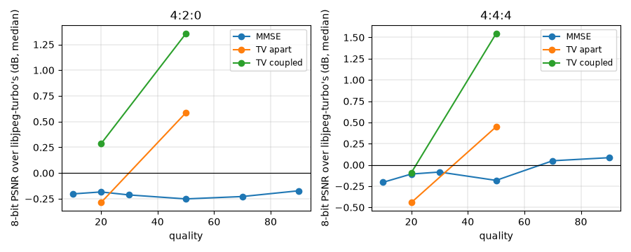

<!-- Written by experiments/phase2_colour.py; do not edit by hand. -->

# Phase 2: colour

- Files: the colour tuning images as libjpeg-turbo encoded them. Baselines on all 216; TV on the 48 in 420, 444 at the qualities 20, 50; TGV on the 12 of the first image of each kind in 420.
- The model of `unround.decode.Settings`, solved in YCbCr (docs/math.md, 4.4), with the channels coupled pixel by pixel or each on its own; measured in the RGB of JFIF's conversion (8): the PSNR of the binary64 result, and the SSIM of its 8-bit samples, the mean over R, G and B.
- References: TV coupled with $\tau/\sigma = 30$, $\rho = 1.5$, 8000 iterations. Stops: the package's defaults. TV apart: 3000 iterations; TGV: 4000, with the defaults.
- NumPy 2.5.3, scikit-image 0.26.0, Pillow 12.3.0.

## The baselines, on every file

Median PSNR (dB) and SSIM of 8-bit pictures over the images: libjpeg-turbo's decoder, and the decoders of the middles of the intervals and of the MMSE centres, each chroma sample repeated over its cell, rounded and clamped.

| sampling | quality | libjpeg | middles | MMSE | SSIM libjpeg | SSIM MMSE |
|---|---|---|---|---|---|---|
| 4:2:0 | 10 | 24.85 | 24.77 | 24.69 | 0.9032 | 0.9135 |
| 4:2:0 | 20 | 27.63 | 27.46 | 27.35 | 0.9365 | 0.9472 |
| 4:2:0 | 30 | 29.39 | 29.20 | 29.10 | 0.9515 | 0.9613 |
| 4:2:0 | 50 | 31.65 | 31.37 | 31.28 | 0.9670 | 0.9721 |
| 4:2:0 | 70 | 33.77 | 33.33 | 33.34 | 0.9783 | 0.9798 |
| 4:2:0 | 90 | 38.54 | 38.53 | 38.33 | 0.9903 | 0.9892 |
| 4:2:2 | 10 | 25.05 | 25.03 | 24.93 | 0.9045 | 0.9156 |
| 4:2:2 | 20 | 27.91 | 27.79 | 27.70 | 0.9364 | 0.9483 |
| 4:2:2 | 30 | 29.70 | 29.59 | 29.48 | 0.9513 | 0.9615 |
| 4:2:2 | 50 | 32.10 | 31.91 | 31.83 | 0.9678 | 0.9746 |
| 4:2:2 | 70 | 34.59 | 34.09 | 34.23 | 0.9795 | 0.9833 |
| 4:2:2 | 90 | 39.96 | 39.88 | 39.68 | 0.9927 | 0.9920 |
| 4:4:4 | 10 | 25.29 | 25.36 | 25.27 | 0.9064 | 0.9176 |
| 4:4:4 | 20 | 28.26 | 28.27 | 28.18 | 0.9399 | 0.9512 |
| 4:4:4 | 30 | 30.14 | 30.18 | 30.09 | 0.9513 | 0.9627 |
| 4:4:4 | 50 | 32.63 | 32.69 | 32.60 | 0.9678 | 0.9755 |
| 4:4:4 | 70 | 35.43 | 35.46 | 35.35 | 0.9799 | 0.9846 |
| 4:4:4 | 90 | 41.68 | 41.83 | 41.83 | 0.9940 | 0.9956 |

In 4:4:4, the decoder of the middles is libjpeg-turbo's but for their arithmetic: over the 72 files, with Y, Cb and Cr clamped to 0-255 before the conversion as libjpeg does, their 8-bit samples differ by at most 2, and by at most 1 in 98.54 per cent of the samples or more (median 99.95). Unclamped, as the result here is, they differ by up to 59 where Y overshoots 255 or 0 (docs/math.md, 8).

## TV, coupled and apart

Median PSNR (dB) and SSIM of 8-bit pictures over the images, on TV's files: libjpeg-turbo's decoder, the MMSE decoder, and TV's results, coupled (the references' last points) and apart.

| sampling | quality | libjpeg | MMSE | TV coupled | TV apart | SSIM libjpeg | SSIM coupled | SSIM apart |
|---|---|---|---|---|---|---|---|---|
| 4:2:0 | 20 | 27.63 | 27.35 | 28.51 | 27.97 | 0.9365 | 0.9819 | 0.9755 |
| 4:2:0 | 50 | 31.65 | 31.28 | 33.56 | 32.81 | 0.9670 | 0.9919 | 0.9893 |
| 4:4:4 | 20 | 28.26 | 28.18 | 28.72 | 28.34 | 0.9399 | 0.9824 | 0.9792 |
| 4:4:4 | 50 | 32.63 | 32.60 | 34.37 | 33.91 | 0.9678 | 0.9953 | 0.9936 |

Less libjpeg-turbo's decoder, file by file, in 8 bits: the files where the PSNR is higher, and the PSNR and the SSIM, median (least to largest).

| model | sampling | quality | higher | PSNR (dB) | SSIM |
|---|---|---|---|---|---|
| TV coupled | 4:2:0 | 20 | 7 of 12 | +0.28 (-0.69 to +3.02) | +0.0452 (+0.0161 to +0.0904) |
| TV coupled | 4:2:0 | 50 | 10 of 12 | +1.36 (-0.64 to +4.58) | +0.0279 (+0.0060 to +0.0873) |
| TV coupled | 4:4:4 | 20 | 5 of 12 | -0.09 (-0.72 to +2.85) | +0.0409 (+0.0189 to +0.0865) |
| TV coupled | 4:4:4 | 50 | 10 of 12 | +1.54 (-0.80 to +4.19) | +0.0255 (+0.0092 to +0.0844) |
| TV apart | 4:2:0 | 20 | 4 of 12 | -0.29 (-1.76 to +1.26) | +0.0400 (+0.0152 to +0.0701) |
| TV apart | 4:2:0 | 50 | 9 of 12 | +0.59 (-0.86 to +2.04) | +0.0253 (+0.0050 to +0.0620) |
| TV apart | 4:4:4 | 20 | 4 of 12 | -0.44 (-2.29 to +1.25) | +0.0389 (+0.0131 to +0.0709) |
| TV apart | 4:4:4 | 50 | 9 of 12 | +0.45 (-0.90 to +2.91) | +0.0249 (+0.0078 to +0.0672) |
| TGV coupled | 4:2:0 | 20 | 3 of 6 | +0.19 (-0.69 to +1.88) | +0.0421 (+0.0089 to +0.0665) |
| TGV coupled | 4:2:0 | 50 | 5 of 6 | +1.27 (-0.65 to +3.22) | +0.0271 (+0.0053 to +0.0488) |
| TGV apart | 4:2:0 | 20 | 2 of 6 | -0.22 (-0.76 to +1.12) | +0.0393 (+0.0088 to +0.0529) |
| TGV apart | 4:2:0 | 50 | 3 of 6 | +0.18 (-0.85 to +1.15) | +0.0236 (+0.0038 to +0.0390) |

Coupled less apart, in 8 bits, file by file: median (least to largest).

| model | sampling | files | PSNR (dB) | SSIM |
|---|---|---|---|---|
| TV | 4:2:0 | 24 | +0.645 (+0.024 to +2.568) | +0.0042 (+0.0003 to +0.0253) |
| TV | 4:4:4 | 24 | +0.581 (+0.047 to +2.506) | +0.0017 (+0.0004 to +0.0172) |
| TGV | 4:2:0 | 12 | +0.340 (-0.101 to +2.122) | +0.0034 (+0.0001 to +0.0140) |

TGV coupled less TV coupled, on TGV's files.

| model | sampling | files | PSNR (dB) | SSIM |
|---|---|---|---|---|
| TGV less TV | 4:2:0 | 12 | +0.010 (-0.412 to +0.154) | -0.0005 (-0.0071 to +0.0036) |

## Stopping TV coupled at a tolerance

Where the gap per sample (the partial gap of docs/math.md, 6.6, where samples are free) first falls within each tolerance, the change against the reference's last point: median / 90th percentile / largest, over the files. Acceptable as phase2_solver.py has it: PSNR 0.001 and 0.005 dB, SSIM 1e-05 and 5e-05; told where at least 10 times the references' median last gap.

| gap per sample ≤ | files | iterations | PSNR (dB) | SSIM | acceptable |
|---|---|---|---|---|---|
| 0.0001 | 46 of 48 | 2805 (1150 to 6410) | 0.0014 / 0.0156 / 0.0573 | 4.5e-06 / 1.3e-04 / 5.1e-04 | no |
| 0.0002 | 46 of 48 | 2245 (850 to 5290) | 0.0024 / 0.0250 / 0.0709 | 8.8e-06 / 1.9e-04 / 5.6e-04 | no |
| 0.0005 | 48 of 48 | 1710 (670 to 7750) | 0.0043 / 0.0454 / 0.0902 | 1.1e-05 / 2.1e-04 / 6.3e-04 | no |
| 0.001 | 48 of 48 | 1370 (490 to 5940) | 0.0055 / 0.0515 / 0.1288 | 1.3e-05 / 2.5e-04 / 6.7e-04 | no |
| 0.002 | 48 of 48 | 1075 (420 to 4130) | 0.0080 / 0.0785 / 0.1959 | 2.8e-05 / 2.7e-04 / 7.2e-04 | no |
| 0.005 | 48 of 48 | 780 (300 to 2190) | 0.0140 / 0.1298 / 0.2730 | 3.7e-05 / 3.0e-04 / 8.4e-04 | no |
| 0.01 | 48 of 48 | 620 (230 to 1360) | 0.0190 / 0.1894 / 0.4139 | 4.8e-05 / 3.1e-04 / 9.5e-04 | no |

No tolerance tried is acceptable and told.
The package's default is 0.0002.

### Two paths, for long

TV coupled along the defaults' path ($\tau/\sigma = 30$, $\rho = 1.9$) and the references' (30, 1.5), on the three files other than gradients whose stops changed most at 0.0002, and on the gradient whose stop changed most: the gap per sample, the PSNR of RGB (binary64) and how far apart the two paths are, and the PSNR of Y against the original's.

| file | iterations | gaps | PSNR RGB (dB) | apart | PSNR Y (dB) |
|---|---|---|---|---|---|
| chart-0-q50-444 | 2000 | 1.8e-04 / 2.0e-04 | 37.4190 / 37.4500 | 0.0310 | 38.6615 / 38.6619 |
| chart-0-q50-444 | 4000 | 3.1e-05 / 5.3e-05 | 37.4001 / 37.3981 | 0.0020 | 38.6621 / 38.6620 |
| chart-0-q50-444 | 8000 | 1.1e-05 / 1.4e-05 | 37.3970 / 37.3970 | 0.0001 | 38.6622 / 38.6622 |
| chart-0-q50-444 | 16000 | 5.3e-06 / 6.7e-06 | 37.3965 / 37.3968 | 0.0004 | 38.6618 / 38.6620 |
| chart-0-q50-420 | 2000 | 6.6e-04 / 6.7e-04 | 36.7834 / 36.7826 | 0.0008 | 38.6149 / 38.6146 |
| chart-0-q50-420 | 4000 | 9.2e-05 / 1.2e-04 | 36.8033 / 36.7981 | 0.0051 | 38.6148 / 38.6149 |
| chart-0-q50-420 | 8000 | 1.5e-05 / 2.9e-05 | 36.8176 / 36.8191 | 0.0015 | 38.6141 / 38.6145 |
| chart-0-q50-420 | 16000 | 4.3e-06 / 5.4e-06 | 36.8181 / 36.8180 | 0.0001 | 38.6137 / 38.6138 |
| text-0-q50-420 | 2000 | 3.1e-04 / 4.8e-04 | 31.3021 / 31.3116 | 0.0095 | 32.5442 / 32.5442 |
| text-0-q50-420 | 4000 | 5.4e-05 / 9.4e-05 | 31.2711 / 31.2801 | 0.0090 | 32.5443 / 32.5443 |
| text-0-q50-420 | 8000 | 1.0e-05 / 1.5e-05 | 31.2690 / 31.2676 | 0.0014 | 32.5443 / 32.5443 |
| text-0-q50-420 | 16000 | 3.0e-06 / 4.1e-06 | 31.2713 / 31.2709 | 0.0004 | 32.5443 / 32.5443 |
| gradient-1-q50-444 | 2000 | 6.7e-05 / 1.4e-05 | 45.5040 / 45.5112 | 0.0072 | 50.3875 / 50.4065 |
| gradient-1-q50-444 | 4000 | 5.0e-06 / 5.7e-06 | 45.4856 / 45.4936 | 0.0080 | 50.3286 / 50.3557 |
| gradient-1-q50-444 | 8000 | 1.7e-06 / 2.6e-06 | 45.4540 / 45.4683 | 0.0143 | 50.2149 / 50.2659 |
| gradient-1-q50-444 | 16000 | 8.4e-07 / 1.1e-06 | 45.3738 / 45.4105 | 0.0367 | 49.9478 / 50.0667 |

## Consistency

The largest excess of the canvas's coefficients, and of those of the RGB of the whole canvas converted back, in steps; and the share of the coefficients within their intervals of the 8-bit picture, over the blocks wholly within it: median (least), per cent.

| decoder | files | canvas | RGB back | 8-bit, whole blocks |
|---|---|---|---|---|
| libjpeg | 216 |  |  | 99.48 (93.89) |
| mmse | 216 | 0.0e+00 | 0.0e+00 | 99.61 (95.16) |
| midpoint | 216 | 0.0e+00 | 0.0e+00 | 99.58 (95.16) |
| TV coupled | 48 | 7.1e-14 | 5.7e-14 | 98.33 (93.59) |
| TV apart | 48 | 7.1e-14 | 7.1e-14 | 98.20 (93.32) |
| TGV coupled | 12 | 5.7e-14 | 5.7e-14 | 97.78 (94.74) |
| TGV apart | 12 | 7.1e-14 | 5.7e-14 | 97.64 (94.43) |

## Time

Median milliseconds of an iteration per million samples of the canvas (three channels), while the other runs of the stage went on in parallel.

| runs | sampling | ms per 10^6 samples |
|---|---|---|
| TV coupled (stops) | 4:2:0 | 301.8 |
| TV coupled (stops) | 4:4:4 | 325.1 |
| TV coupled | 4:2:0 | 355.2 |
| TV coupled | 4:4:4 | 383.7 |
| TV apart | 4:2:0 | 309.3 |
| TV apart | 4:4:4 | 332.1 |
| TGV coupled | 4:2:0 | 775.8 |
| TGV apart | 4:2:0 | 792.8 |
