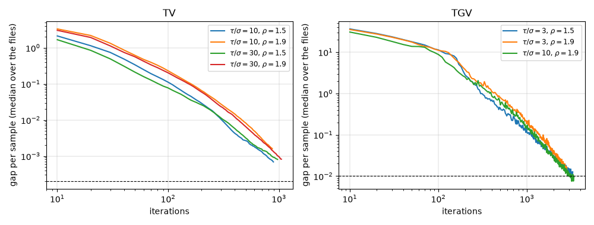

<!-- Written by experiments/phase2_solver.py; do not edit by hand. -->

# Phase 2: the primal-dual method relaxed

- Files: those of phase1-tuning.md, the greyscale tuning images as libjpeg-turbo encoded them: TV on all 48, TGV on the 24 of the first image of each kind. The weights of `unround.decode.Settings`.
- The method is the relaxed one of docs/math.md, 5, with the ratio of the steps $\tau/\sigma$ and the relaxation $\rho$.
- References: TV with $\tau/\sigma = 30$, $\rho = 1.5$, 8000 iterations; TGV with $\tau/\sigma = 3$, $\rho = 1.9$, 12000 iterations.
- Stopping where the gap per sample first falls within a tolerance changes the result, against the reference's last point. A tolerance is acceptable when, over the files, the change of the PSNR of the binary64 result is at most 0.001 dB in the median and 0.005 dB in the 90th percentile, and that of the SSIM of its 8-bit samples at most 1e-05 and 5e-05; every file has to reach it, and the references have to tell it: their median last gap per sample at most 1/10 of it. The largest changes are shown.
- NumPy 2.5.3, SciPy 1.18.1, scikit-image 0.26.0.

## TV

### Stopping at a tolerance

| variant | gap per sample ≤ | files that reached it | iterations: median (least to largest) | iterations in all | \|Δ PSNR\|, binary64, dB: median / 90th / largest | \|Δ SSIM\|, 8 bits: median / 90th / largest | acceptable |
|---|---|---|---|---|---|---|---|
| $\tau/\sigma = 10$, $\rho = 1.5$ | 0.01 | 48 of 48 | 305 (110 to 1170) | 19960 | 0.0054 / 0.0189 / 0.0357 | 1.3e-05 / 9.0e-05 / 2.2e-04 | no |
| $\tau/\sigma = 10$, $\rho = 1.5$ | 0.005 | 48 of 48 | 385 (150 to 1540) | 26480 | 0.0027 / 0.0118 / 0.0182 | 6.5e-06 / 7.1e-05 / 2.3e-04 | no |
| $\tau/\sigma = 10$, $\rho = 1.5$ | 0.002 | 48 of 48 | 570 (250 to 2340) | 38340 | 0.0011 / 0.0098 / 0.0151 | 5.0e-06 / 7.7e-05 / 1.8e-04 | no |
| $\tau/\sigma = 10$, $\rho = 1.5$ | 0.001 | 48 of 48 | 755 (360 to 3010) | 50090 | 0.0007 / 0.0078 / 0.0187 | 2.8e-06 / 8.9e-05 / 1.9e-04 | no |
| $\tau/\sigma = 10$, $\rho = 1.5$ | 0.0005 | 48 of 48 | 1050 (530 to 4140) | 66690 | 0.0007 / 0.0056 / 0.0193 | 3.3e-06 / 8.8e-05 / 2.0e-04 | no |
| $\tau/\sigma = 10$, $\rho = 1.5$ | 0.0002 | 48 of 48 | 1640 (890 to 6420) | 99740 | 0.0002 / 0.0031 / 0.0143 | 1.9e-06 / 1.0e-04 / 1.6e-04 | no |
| $\tau/\sigma = 10$, $\rho = 1.9$ | 0.01 | 48 of 48 | 460 (160 to 1160) | 24500 | 0.0013 / 0.0096 / 0.0160 | 7.9e-06 / 1.0e-04 / 2.9e-04 | no |
| $\tau/\sigma = 10$, $\rho = 1.9$ | 0.005 | 48 of 48 | 595 (220 to 1480) | 31730 | 0.0015 / 0.0078 / 0.0239 | 4.1e-06 / 1.2e-04 / 2.5e-04 | no |
| $\tau/\sigma = 10$, $\rho = 1.9$ | 0.002 | 48 of 48 | 805 (320 to 2180) | 44000 | 0.0006 / 0.0067 / 0.0207 | 3.5e-06 / 1.3e-04 / 2.2e-04 | no |
| $\tau/\sigma = 10$, $\rho = 1.9$ | 0.001 | 48 of 48 | 1005 (440 to 2880) | 55460 | 0.0006 / 0.0056 / 0.0176 | 2.8e-06 / 1.1e-04 / 2.1e-04 | no |
| $\tau/\sigma = 10$, $\rho = 1.9$ | 0.0005 | 48 of 48 | 1220 (610 to 3840) | 69830 | 0.0003 / 0.0036 / 0.0159 | 2.7e-06 / 1.1e-04 / 1.8e-04 | no |
| $\tau/\sigma = 10$, $\rho = 1.9$ | 0.0002 | 48 of 48 | 1590 (870 to 5940) | 96500 | 0.0002 / 0.0031 / 0.0137 | 1.6e-06 / 1.1e-04 / 1.6e-04 | no |
| $\tau/\sigma = 30$, $\rho = 1.5$ | 0.01 | 48 of 48 | 325 (110 to 1040) | 17810 | 0.0056 / 0.0140 / 0.0211 | 1.1e-05 / 9.0e-05 / 1.9e-04 | no |
| $\tau/\sigma = 30$, $\rho = 1.5$ | 0.005 | 48 of 48 | 425 (170 to 1470) | 24090 | 0.0038 / 0.0114 / 0.0184 | 1.0e-05 / 6.5e-05 / 1.5e-04 | no |
| $\tau/\sigma = 30$, $\rho = 1.5$ | 0.002 | 48 of 48 | 605 (300 to 2310) | 36060 | 0.0022 / 0.0065 / 0.0149 | 5.6e-06 / 6.0e-05 / 1.5e-04 | no |
| $\tau/\sigma = 30$, $\rho = 1.5$ | 0.001 | 48 of 48 | 865 (460 to 2900) | 48960 | 0.0010 / 0.0067 / 0.0147 | 4.3e-06 / 2.5e-05 / 1.9e-04 | no |
| $\tau/\sigma = 30$, $\rho = 1.5$ | 0.0005 | 48 of 48 | 1245 (650 to 4090) | 67150 | 0.0011 / 0.0040 / 0.0156 | 3.3e-06 / 5.1e-05 / 1.6e-04 | no |
| $\tau/\sigma = 30$, $\rho = 1.5$ | 0.0002 | 48 of 48 | 2020 (970 to 6390) | 105540 | 0.0003 / 0.0021 / 0.0111 | 2.4e-06 / 3.4e-05 / 1.2e-04 | yes |
| $\tau/\sigma = 30$, $\rho = 1.9$ | 0.01 | 48 of 48 | 435 (170 to 1120) | 23410 | 0.0025 / 0.0083 / 0.0229 | 7.4e-06 / 9.2e-05 / 2.8e-04 | no |
| $\tau/\sigma = 30$, $\rho = 1.9$ | 0.005 | 48 of 48 | 555 (230 to 1460) | 30500 | 0.0016 / 0.0065 / 0.0096 | 4.4e-06 / 1.1e-04 / 2.3e-04 | no |
| $\tau/\sigma = 30$, $\rho = 1.9$ | 0.002 | 48 of 48 | 785 (350 to 1970) | 42290 | 0.0014 / 0.0071 / 0.0121 | 4.4e-06 / 3.9e-05 / 1.7e-04 | no |
| $\tau/\sigma = 30$, $\rho = 1.9$ | 0.001 | 48 of 48 | 980 (500 to 2730) | 54120 | 0.0011 / 0.0040 / 0.0161 | 3.7e-06 / 7.6e-05 / 1.6e-04 | no |
| $\tau/\sigma = 30$, $\rho = 1.9$ | 0.0005 | 48 of 48 | 1265 (720 to 3320) | 69500 | 0.0004 / 0.0033 / 0.0150 | 2.8e-06 / 6.2e-05 / 1.4e-04 | no |
| $\tau/\sigma = 30$, $\rho = 1.9$ | 0.0002 | 48 of 48 | 1800 (1050 to 5070) | 99760 | 0.0002 / 0.0019 / 0.0100 | 2.1e-06 / 3.7e-05 / 1.1e-04 | yes |

Chosen: $\tau/\sigma = 30$, $\rho = 1.9$, stopping at a gap per sample of 0.0002, and after at most 20000 iterations (twice the most a tuning file took, rounded up).

The references' own change over their last sixth: median (least to largest) over the files. Their median last gap per sample is 1.6e-05, so that they tell tolerances of 1.6e-04 and more.

| iterations | \|Δ PSNR\|, binary64, dB | \|Δ SSIM\|, 8 bits |
|---|---|---|
| 6666 to 8000 | 0.0000 (0.0000 to 0.0015) | 4.5e-07 (9.9e-09 to 5.0e-05) |

Phase 1's stops (unrelaxed, $\tau/\sigma = 30$) against these references: Phase 1 measured them against its own long runs, which went on from the stops along the same path, and found at most 0.0083 dB at 5e-4.

| gap per sample ≤ | files | \|Δ PSNR\|, binary64, dB: median / 90th / largest | \|Δ SSIM\|, 8 bits: median / 90th / largest |
|---|---|---|---|
| 0.0005 | 48 of 48 | 0.0008 / 0.0062 / 0.0142 | 3.5e-06 / 2.9e-05 / 1.7e-04 |
| 0.001 | 48 of 48 | 0.0012 / 0.0093 / 0.0129 | 4.4e-06 / 4.2e-05 / 2.0e-04 |

### What else was tried

On three files, with Phase 1's ratio $\tau/\sigma = 30$: the first iteration whose gap per sample is within each tolerance, and the change of the PSNR of the binary64 result, against the reference's last point, at some iterations.

| method | file | gap ≤ 0.001 | gap ≤ 0.0005 | Δ PSNR at 1000 | Δ PSNR at 2000 |
|---|---|---|---|---|---|
| relaxed, $\rho$ = 1 | chart-0-grey q10 | 1940 | > 2500 | -0.010 | -0.002 |
| relaxed, $\rho$ = 1 | illustration-0-grey q30 | 1230 | 1560 | -0.002 | +0.000 |
| relaxed, $\rho$ = 1 | text-0-grey q50 | 710 | 1040 | -0.001 | -0.000 |
| relaxed, $\rho$ = 1.5 | chart-0-grey q10 | 1340 | 1780 | -0.005 | +0.001 |
| relaxed, $\rho$ = 1.5 | illustration-0-grey q30 | 860 | 1070 | +0.001 | +0.000 |
| relaxed, $\rho$ = 1.5 | text-0-grey q50 | 520 | 720 | -0.000 | -0.000 |
| relaxed, $\rho$ = 1.9 | chart-0-grey q10 | 1610 | 2030 | -0.001 | +0.002 |
| relaxed, $\rho$ = 1.9 | illustration-0-grey q30 | 960 | 1160 | +0.000 | +0.000 |
| relaxed, $\rho$ = 1.9 | text-0-grey q50 | 820 | 1040 | -0.000 | -0.000 |
| adaptive, proportion = 0.3 | chart-0-grey q10 | > 2500 | > 2500 | -0.013 | -0.006 |
| adaptive, proportion = 0.3 | illustration-0-grey q30 | 1170 | 1440 | +0.001 | +0.000 |
| adaptive, proportion = 0.3 | text-0-grey q50 | 910 | 1190 | -0.000 | -0.000 |
| adaptive, proportion = 1 | chart-0-grey q10 | > 2500 | > 2500 | -0.014 | -0.013 |
| adaptive, proportion = 1 | illustration-0-grey q30 | 1610 | 1980 | +0.020 | +0.004 |
| adaptive, proportion = 1 | text-0-grey q50 | 1390 | 1750 | -0.000 | -0.000 |
| adaptive, proportion = 3 | chart-0-grey q10 | > 2500 | > 2500 | +0.056 | -0.014 |
| adaptive, proportion = 3 | illustration-0-grey q30 | > 2500 | > 2500 | +0.131 | +0.040 |
| adaptive, proportion = 3 | text-0-grey q50 | > 2500 | > 2500 | -0.007 | -0.001 |

## TGV

### Stopping at a tolerance

| variant | gap per sample ≤ | files that reached it | iterations: median (least to largest) | iterations in all | \|Δ PSNR\|, binary64, dB: median / 90th / largest | \|Δ SSIM\|, 8 bits: median / 90th / largest | acceptable |
|---|---|---|---|---|---|---|---|
| $\tau/\sigma = 3$, $\rho = 1.5$ | 0.05 | 24 of 24 | 1455 (440 to 2580) | 36130 | 0.0155 / 0.0957 / 0.1546 | 2.4e-05 / 1.1e-04 / 3.1e-04 | no |
| $\tau/\sigma = 3$, $\rho = 1.5$ | 0.02 | 24 of 24 | 2185 (760 to 3820) | 54730 | 0.0125 / 0.0826 / 0.1280 | 2.0e-05 / 8.3e-05 / 1.9e-04 | no |
| $\tau/\sigma = 3$, $\rho = 1.5$ | 0.01 | 24 of 24 | 2955 (1120 to 5170) | 72660 | 0.0069 / 0.0720 / 0.0955 | 1.6e-05 / 6.2e-05 / 1.3e-04 | no |
| $\tau/\sigma = 3$, $\rho = 1.5$ | 0.005 | 24 of 24 | 4355 (1710 to 7290) | 107360 | 0.0034 / 0.0627 / 0.0883 | 1.0e-05 / 6.8e-05 / 1.2e-04 | not told |
| $\tau/\sigma = 3$, $\rho = 1.5$ | 0.002 | 24 of 24 | 6545 (3280 to 10520) | 159420 | 0.0011 / 0.0353 / 0.0893 | 6.6e-06 / 3.1e-05 / 5.3e-05 | not told |
| $\tau/\sigma = 3$, $\rho = 1.9$ | 0.05 | 24 of 24 | 1750 (530 to 2610) | 39500 | 0.0121 / 0.0790 / 0.1289 | 2.1e-05 / 8.3e-05 / 2.1e-04 | no |
| $\tau/\sigma = 3$, $\rho = 1.9$ | 0.02 | 24 of 24 | 2340 (740 to 3650) | 56300 | 0.0070 / 0.0720 / 0.0886 | 1.7e-05 / 7.5e-05 / 1.3e-04 | no |
| $\tau/\sigma = 3$, $\rho = 1.9$ | 0.01 | 24 of 24 | 3110 (1020 to 4620) | 73500 | 0.0046 / 0.0509 / 0.1002 | 9.6e-06 / 6.6e-05 / 1.2e-04 | no |
| $\tau/\sigma = 3$, $\rho = 1.9$ | 0.005 | 24 of 24 | 3975 (1600 to 6180) | 99010 | 0.0026 / 0.0434 / 0.0886 | 5.1e-06 / 4.6e-05 / 9.2e-05 | not told |
| $\tau/\sigma = 3$, $\rho = 1.9$ | 0.002 | 24 of 24 | 6035 (2810 to 8490) | 144790 | 0.0011 / 0.0280 / 0.0717 | 2.9e-06 / 3.1e-05 / 6.2e-05 | not told |
| $\tau/\sigma = 10$, $\rho = 1.9$ | 0.05 | 24 of 24 | 1515 (530 to 2560) | 36770 | 0.0210 / 0.1070 / 0.2057 | 4.0e-05 / 1.2e-04 / 2.6e-04 | no |
| $\tau/\sigma = 10$, $\rho = 1.9$ | 0.02 | 24 of 24 | 2150 (730 to 3710) | 51950 | 0.0115 / 0.0969 / 0.1251 | 1.7e-05 / 7.4e-05 / 1.6e-04 | no |
| $\tau/\sigma = 10$, $\rho = 1.9$ | 0.01 | 24 of 24 | 2735 (1170 to 4570) | 68480 | 0.0087 / 0.0929 / 0.1051 | 1.9e-05 / 7.5e-05 / 1.3e-04 | no |
| $\tau/\sigma = 10$, $\rho = 1.9$ | 0.005 | 24 of 24 | 3785 (1830 to 5890) | 93050 | 0.0057 / 0.0757 / 0.1120 | 1.1e-05 / 6.4e-05 / 1.2e-04 | not told |
| $\tau/\sigma = 10$, $\rho = 1.9$ | 0.002 | 24 of 24 | 6040 (3380 to 8410) | 144180 | 0.0018 / 0.0357 / 0.0853 | 4.2e-06 / 4.8e-05 / 8.3e-05 | not told |

No variant has a tolerance that every file reached, that the references tell and that is acceptable. Chosen, the least of those that every file reached: $\tau/\sigma = 10$, $\rho = 1.9$, stopping at a gap per sample of 0.01, and after at most 10000 iterations (twice the most a tuning file took, rounded up). Stopping there changed the PSNR by 0.0087 dB in the median, 0.0929 dB in the 90th percentile and 0.1051 dB at most.

The references' own change over their last sixth: median (least to largest) over the files. Their median last gap per sample is 6.7e-04, so that they tell tolerances of 6.7e-03 and more.

| iterations | \|Δ PSNR\|, binary64, dB | \|Δ SSIM\|, 8 bits |
|---|---|---|
| 10000 to 12000 | 0.0004 (0.0000 to 0.0173) | 8.8e-07 (1.7e-09 to 5.6e-05) |

### What else was tried

On three files, with Phase 1's ratio $\tau/\sigma = 3$: the first iteration whose gap per sample is within each tolerance, and the change of the PSNR of the binary64 result, against the reference's last point, at some iterations.

| method | file | gap ≤ 0.02 | gap ≤ 0.01 | Δ PSNR at 1000 | Δ PSNR at 2000 | Δ PSNR at 3000 | Δ PSNR at 4000 |
|---|---|---|---|---|---|---|---|
| relaxed, $\rho$ = 1 | chart-0-grey q10 | 3830 | > 4000 | +0.128 | +0.076 | +0.072 | +0.038 |
| relaxed, $\rho$ = 1 | illustration-0-grey q30 | 2750 | 3950 | -0.019 | -0.021 | -0.023 | -0.016 |
| relaxed, $\rho$ = 1 | text-0-grey q50 | 2900 | > 4000 | -0.048 | -0.038 | -0.032 | -0.020 |
| relaxed, $\rho$ = 1.5 | chart-0-grey q10 | 2780 | 3800 | +0.079 | +0.071 | +0.009 | -0.025 |
| relaxed, $\rho$ = 1.5 | illustration-0-grey q30 | 2160 | 2990 | -0.015 | -0.023 | -0.012 | -0.002 |
| relaxed, $\rho$ = 1.5 | text-0-grey q50 | 2510 | 3140 | -0.040 | -0.032 | -0.016 | -0.005 |
| relaxed, $\rho$ = 1.9 | chart-0-grey q10 | 3510 | > 4000 | +0.069 | +0.046 | -0.024 | -0.038 |
| relaxed, $\rho$ = 1.9 | illustration-0-grey q30 | 2570 | 3270 | -0.020 | -0.018 | -0.005 | +0.005 |
| relaxed, $\rho$ = 1.9 | text-0-grey q50 | 2380 | 3160 | -0.038 | -0.023 | -0.007 | -0.001 |
| adaptive, proportion = 0.3 | chart-0-grey q10 | > 4000 | > 4000 | -0.073 | -0.050 | -0.039 | -0.063 |
| adaptive, proportion = 0.3 | illustration-0-grey q30 | 2140 | 3330 | -0.042 | -0.031 | -0.026 | -0.019 |
| adaptive, proportion = 0.3 | text-0-grey q50 | 3180 | > 4000 | -0.063 | -0.046 | -0.038 | -0.027 |
| adaptive, proportion = 1 | chart-0-grey q10 | > 4000 | > 4000 | +0.234 | +0.174 | +0.159 | +0.128 |
| adaptive, proportion = 1 | illustration-0-grey q30 | 3350 | > 4000 | +0.018 | -0.006 | -0.012 | -0.010 |
| adaptive, proportion = 1 | text-0-grey q50 | > 4000 | > 4000 | -0.050 | -0.031 | -0.023 | -0.014 |
| adaptive, proportion = 3 | chart-0-grey q10 | > 4000 | > 4000 | +0.394 | +0.317 | +0.266 | +0.242 |
| adaptive, proportion = 3 | illustration-0-grey q30 | > 4000 | > 4000 | +0.139 | +0.035 | +0.011 | +0.006 |
| adaptive, proportion = 3 | text-0-grey q50 | > 4000 | > 4000 | -0.204 | -0.044 | -0.027 | -0.019 |
| from TV, $\rho$ = 1 | chart-0-grey q10 (after 2560 of TV) | 3880 | > 4000 | +0.346 | +0.210 | +0.199 | +0.190 |
| from TV, $\rho$ = 1 | illustration-0-grey q30 (after 1560 of TV) | 2520 | 3680 | -0.029 | -0.024 | -0.015 | -0.012 |
| from TV, $\rho$ = 1 | text-0-grey q50 (after 1040 of TV) | 3040 | > 4000 | -0.036 | -0.036 | -0.033 | -0.024 |
| from TV, $\rho$ = 1.9 | chart-0-grey q10 (after 2560 of TV) | 3470 | > 4000 | +0.213 | +0.194 | +0.120 | +0.044 |
| from TV, $\rho$ = 1.9 | illustration-0-grey q30 (after 1560 of TV) | 2310 | 3060 | -0.024 | -0.012 | -0.007 | +0.002 |
| from TV, $\rho$ = 1.9 | text-0-grey q50 (after 1040 of TV) | 2270 | 2950 | -0.036 | -0.025 | -0.009 | -0.002 |

## The test images

libjpeg-turbo's greyscale test files, solved with Phase 1's defaults (phase1-comparison.md) and with these: the median and the largest number of iterations, the median time (the iterations times the time an iteration took, one run after another in one process), and the change of the PSNR of the binary64 result and of the SSIM of its 8-bit samples.

**TV**

| quality | iterations: median | largest | seconds: median | Δ PSNR, binary64, dB: mean (least to largest) | Δ SSIM, 8 bits: mean |
|---|---|---|---|---|---|
| 10 | 3715 to 3335 | 5180 to 5430 | 33.0 to 43.7 | +0.0014 (-0.0008 to +0.0060) | +2.1e-05 |
| 20 | 2515 to 2340 | 3330 to 3460 | 26.3 to 35.0 | -0.0004 (-0.0026 to +0.0006) | -2.0e-05 |
| 30 | 1650 to 2035 | 2380 to 2690 | 16.7 to 25.8 | -0.0000 (-0.0023 to +0.0030) | +2.3e-06 |
| 50 | 1330 to 1720 | 2010 to 2790 | 14.3 to 21.0 | -0.0009 (-0.0053 to +0.0020) | -1.5e-06 |
| 70 | 1380 to 1470 | 2100 to 2580 | 17.1 to 19.6 | -0.0009 (-0.0067 to +0.0015) | -5.1e-07 |
| 90 | 1560 to 1860 | 2350 to 2200 | 17.9 to 23.7 | -0.0005 (-0.0033 to +0.0010) | -1.6e-07 |

**TGV**

| quality | iterations: median | largest | seconds: median | Δ PSNR, binary64, dB: mean (least to largest) | Δ SSIM, 8 bits: mean |
|---|---|---|---|---|---|
| 10 | 6230 to 4395 | 9630 to 5890 | 137.8 to 123.4 | -0.0131 (-0.0978 to +0.0124) | -2.3e-06 |
| 20 | 4835 to 3610 | 7510 to 4560 | 118.7 to 114.6 | +0.0017 (-0.0112 to +0.0188) | +2.9e-06 |
| 30 | 4310 to 3540 | 6830 to 4460 | 108.7 to 100.1 | -0.0001 (-0.0204 to +0.0072) | -6.3e-06 |
| 50 | 3730 to 2840 | 5330 to 3660 | 96.1 to 83.2 | -0.0011 (-0.0121 to +0.0037) | +3.9e-06 |
| 70 | 2985 to 2345 | 4410 to 2750 | 81.7 to 74.7 | -0.0009 (-0.0083 to +0.0116) | +2.1e-07 |
| 90 | 2030 to 1700 | 3210 to 2030 | 59.6 to 43.8 | -0.0031 (-0.0165 to +0.0007) | -1.2e-06 |

## Figure

